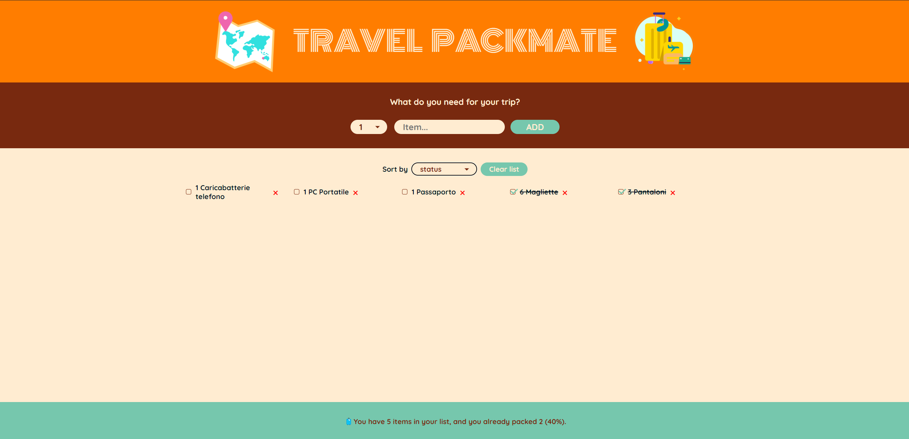
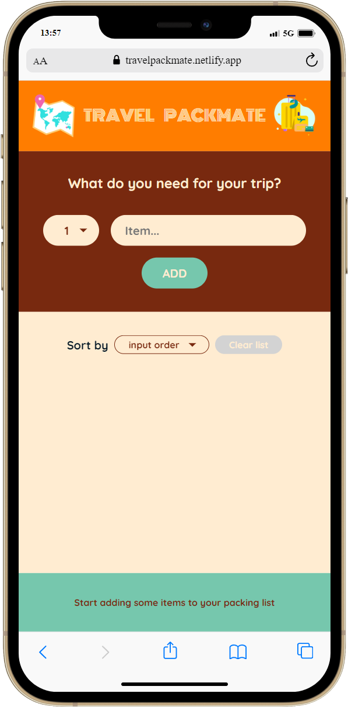

# Travel PackMate

  
  

TravelPackMate è un'applicazione progettata per aiutare gli utenti a tenere traccia degli oggetti da mettere in valigia per un viaggio. L'app consente agli utenti di inserire elementi in una lista, contrassegnare gli elementi messi in valigia, eliminare elementi e ordinare la lista in vari modi.

## Funzionalità

- Aggiungi elementi alla lista di imballaggio
- Elimina elementi dalla lista
- Segna gli elementi come inseriti/non inseriti in valigia
- Ordina gli elementi per ordine di inserimento, ordine alfabetico o stato (inseriti in valigia o no)
- Utilizzo del localStorage per salvare la lista di elementi

## Tecnologie Utilizzate

- HTML
- CSS
- React
- PWA

## Sfide Affrontate

Descrivi brevemente le sfide principali che hai affrontato durante lo sviluppo di questo esercizio e come le hai superate.

## Cosa Ho Imparato

Elenca i principali concetti o tecniche che hai appreso realizzando questo progetto.

## Visualizzare il progetto

Si può visionare il progetto a questo indirizzo [https://travelpackmate.netlify.app/](https://travelpackmate.netlify.app/) da desktop, oppure installare la PWA tramite q1uesti passaggi una volta aperto il link su un dispositivo mobile:
1. Tocca l'icona "Condividi" (il quadrato con la freccia verso l'alto) nella barra degli strumenti.
2. Scorri verso il basso e tocca "Aggiungi alla schermata Home".
3. Personalizza il nome dell'app se lo desideri.
4. Tocca "Aggiungi" nell'angolo in alto a destra.
5. L'icona della tua PWA apparirà sulla schermata Home del dispositivo.
